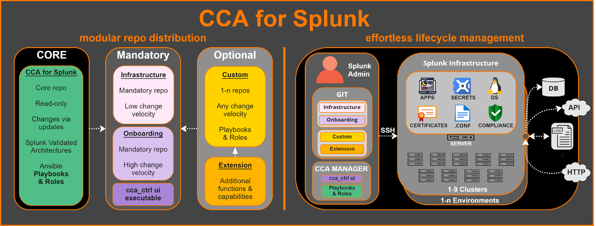

# CCA for Splunk

Ever wished you had a central interface to interact with all aspects of Splunk architecture and administration? Let's be honest, running Splunk is all about finding an efficient and scalable way to manage all .conf files and the other magic under the hood. At scale, the complexity often gives way to either speed or quality - if you don't find a way to automate it.

That is precisely what we've done for years, and now it's time to share how you can do it to. Our solution enables a full lifecycle management of Splunk using a Continuous Configuration Automation framework powered by Ansible.

See how you can manage certificates, upgrades & app deployments with full control and flexibility.

You can find the Project Presentation as well as a Q&A section in the [Wiki](https://github.com/innovationfleet/cca_for_splunk/wiki).

# Do I need CCA for Splunk ?

Whether you use & manage Splunk internally, or if you are a consultant with Splunk expertise deploying architecture for your clients, or if you want to deploy standalone test or development instance, or deploy a new enterprise multi-site cluster - CCA for Splunk suits all possible use cases & scenarios and can be your greatest companion in your Splunk administration journey.

With this framework you are able to automatically deploy a full Splunk cluster on-prem or cloud in just a few minutes... with no hands-on required on your Splunk servers :)

If you invest time in implementing CCA for Splunk you can recover time lost later with automatic manual tasks, but perhaps more importantly also gain better configuration consistency across your platform, raise quality of your services dependent on Splunk - all while keeping it secure and ready to deliver business value!

# Where does CCA for come from ?

The framework concept utilized in CCA for Splunk goes back several years and has proven to be absolutely critical in managing complex Splunk infrastructures with 100+ servers in several environments. 450+ tasks has been developed across 10 carefully created Ansible roles. For this first release, more than 1000 development hours have been invested, so that you can get the scalability that you should expect out of a automation framework.
Besides adding your servers to the ansible inventory file, there is less than 25 parameters that you have to set per environment - then off you go to much different Splunk journey going forward.

The templates that we provide for configuring Splunk roles are used in our own Multisite Cluster implementations. After you have configured your project, the control is in your hands when it comes to deciding your settings. Adding or modifying parameters has no impact on the framework and are localized under your control.

Playbooks are DRY (Don't Repeat Yourself), with almost no tasks - instead they are using common code in roles. So an update of a task has just to be done in one place, keeping code updates much cleaner and easily overviewed.

# Technically what is CCA for Splunk ?

CCA for Splunk is powered by Ansible. There's multiple playbooks used to interact with your operating system (OS) & Splunk to apply configurations and maintain a desired & approved state of your Splunk platform. All of the Splunk configurations performed by CCA for Splunk resides in Git, allowing for a single point of truth, increasing tracking ability of performed changed and handle everything with speed and efficiency.

No need to spend unnecessary hours on troubleshooting your Splunk platform where the root cause is mismatched configurations between your servers, simply apply your configuration changes in Git & Ansible takes care of the rest.

# Design philosophy

Building an automation framework that scale from the smallest Splunk test server up to 9 parallel index and search head clusters in any number of environments is a challenge of it's own. At your fingertips, this is the power you will get by using **Continuous Configuration Automation (CCA) for Splunk**

Our design principles behind the project are:
* Security Everywhere
* No hands on servers
* Make data valuable
* Sharing is caring

We base our configuration and naming standard on [Splunk Validated Architecture](https://www.splunk.com/pdfs/technical-briefs/splunk-validated-architectures.pdf) description. See [Ansible Inventory File](/environments/infra_template/hosts) for naming convention and Ansible groups layout.

# Architecture
## Prerequisites
Before you can initiate CCA for Splunk, the environments needs to fulfil some basic requirements. The easiest way to see how well you comply with these are to follow the instructions provided in [Automation Readiness](/automation_readiness.md).

## The Manager server
CCA for Splunk uses 3 repositories:
One original repo and two that will be automatically created at launch. The repositories sits on the Manager server. Using a central server where all Splunk configurations will be kept and up to date with your upstream repositories, is a really good start for a successful and secure management of your Splunk infrastructure.

Let ansible run under a technical user on the manager server and have users `sudo` to this user from their personal ones.

### Repositories:



- **CORE - cca_for_splunk** : This is the main repository where the core code of CCA for Splunk is stored. Treat this repository as read-only, do not store any custom playbooks or roles in this repo as that will break future updates. Custom roles and playbooks can easily be added to the below repositories in their respective `roles` and `playbooks` directory. Inclusion of the custom playbooks are automatic in `cca_ctrl`

- **Mandatory - cca_splunk_infrastructure**: This repository holds all Splunk infrastructure configurations, files and Ansible inventory information that is needed to correctly install and configure Splunk on an infrastructure server. You will also be able to import custom roles to the framework using this repository. It supports any number of environments and have pre-configured directories to manage up to 9 different index and search head clusters per environment, equipped for giant Splunk installations.

- **Mandatory - cca_splunk_onboardings**: This repository holds all Apps, Deployment Apps, Master Apps and Search Head Cluster Apps in a version controlled manner. It supports any number of environments and have pre-configured directories to manage up to 9 different index and search head cluster per environment.

- **Mandatory - cca_ctrl**: This executable is the operational centre of CCA for Splunk! We´ve developed a UI using Whiptail that is as old-school as it is well supported by basically any terminal. From cca_ctrl you instruct CCA for Splunk what to run, where and how from all from a central menu.

- **Optional - Custom Roles & Playbooks**: If you want to create your own custom Roles & Playbooks it´s easy to do so, and they will operate together with the default from within CCA for Splunk.

- **Optional - Custom Extension**: If you want to extend the functionality of CCA for Splunk to cover a completely new capability, that´s also possible - the extentions instructs custom Roles & Playbooks and gets picked up by CCA for Splunk.

# How to get started

**Step 1: Plan your architecture**
 CCA for Splunk can deploy from standalone servers to multisite clusters, and up to 9 clusters, controlled by the same automation framework.
 A proper planning is key to define the type of architure(s) will be created, their environment, individual specifications and requirements.

**Step 2: Install the Manager and pull CCA for Splunk**
Machine minimum requirements:
 CPU: 2core
 RAM: 4GB
 Disk: 40GB
 preferred OS: RHEL 8 or higher, CentOS 8 stream or higher

**a)** from the cca_for_splunk repo, run the Readiness playbooks to ensure that you have the prerequisites and install missing tools/packages:
Read up on our [Automation Readiness](/automation_readiness.md) page.

These playbooks will check your automation readiness of both the Manager server, and your Splunk infrastructure in simple assert tasks. When you have passed all assert checks, your environment is ready for the automation journey to start.

**b**) run `./cca_crtl --setup` from the **cca_for_splunk** repo. The wizard will ask you to provide the following information:

* Name of your repo to store Splunk Infrastructure configuration (cca_splunk_infrastructure)
* Name of your repo to store Splunk Onboarding configuration (cca_splunk_onboarding)
* Name of your environment (cca_lab)

When this information is collected a temporary splunk installation will be performed and used to generate a splunk.secret file, hash passwords and pass4SymmKeys. After the installation is completed you will be asked to provide the following information:

* The name of the admin user (admin)
* The password for the admin user, a random password is generated. Store it if you choose to use it.
* The general pass4SymmKey that is used by Splunk for S2S communication, like communication to license managers. If you have an existing infrastructure, use that pass4SymmKey. If not keep the random key.

Next comes a generation of 4 different sslpasswords, server, web, inputs and outputs. CCA for Splunk can deploy used 4 unique certificates to the infrastructure. If you already have certificates that can be used, use the password that correlates to the respective private key. Read more about [certificates](/roles/cca.splunk.ssl-certificates/README.md).

* Password for Server Certificate
* Password for Inputs Certificate
* Password for Outputs Certificate
* Password for Web Certificate

The wizard assumes that you have 1 index and 1 search head cluster and will prompt for pass4SymmKeys for those clusters. If you have an existing cluster, add the existing pass4SymmKey instead of the pre-generated one.

* Cluster C1 pass4SymmKey
* Search Head Cluster C1 pass4SymmKey

In the background 8 more pass4SymmKeys for respective cluster is generated and stored in the Splunk Infrastructure repo at environments/ENVIRONMENT_NAME/group_vars/all/cca_splunk_secrets

To access the cleartext value of one of the ansible secrets, run the following command from the relevant repo. Replace the variable specified for `var`.
```
ansible -i environments/cca_lab -m debug -a "var=cca_splunk_certs_server_default_sslpassword" localhost
```

**c**) Verification
verify that two companion repos has been created and staged with the correct information.

**Step 3:**  Update ansible inventory files and variable values in the following files in your environment directory.

* group_vars/all/env_specific
  * cca_splunk_license_manager_uri: 'https://UPDATE_LICENSE_MANGER_FQDN:8089'
  * UPDATE the clustering manager uris if needed.
  * cca_splunk_alert_action_smtp: 'UPDATE_SMTP_SERVER_FQDN'
  * cca_splunk_health_alert_action_email_to: 'UPDATE_ALERT_EMAIL_ADDRESS'
  * cca_splunk_extension_cert_rootca: 'UPDATE_ROOT_CA_EXPIRE_DATE_Issuing_CA_EXPIRE_DATE.pem'
  * cca_splunk_extension_server_cert: 'splunk-server_UPDATE_EXPIRE_DATE.cer'
  * cca_splunk_extension_server_key: 'splunk-server_UPDATE_EXPIRE_DATE.key'
  * cca_splunk_extension_inputs_cert: 'splunk-inputs_UPDATE_EXPIRE_DATE.cer'
  * cca_splunk_extension_inputs_key: 'splunk-inputs_UPDATE_EXPIRE_DATE.key'
  * cca_splunk_extension_outputs_cert: 'splunk-outputs_UPDATE_EXPIRE_DATE.cer'
  * cca_splunk_extension_outputs_key: 'splunk-outputs_UPDATE_EXPIRE_DATE.key'
  * cca_splunk_extension_web_cert: 'splunk-web_UPDATE_EXPIRE_DATE.cer'
  * cca_splunk_extension_web_key: 'splunk-web_UPDATE_EXPIRE_DATE.key'
  * 'UPDATE_LICENSE_FILE.lic'
* group_vars/all/linux
  * splunk_user_uid: 'UPDATE_SPLUNK_UID'
  * splunk_user_gid: 'UPDATE_SPLUNK_GID'
* hosts
  * UPDATE Splunk S2S ports if the default don't match your environment.
  * UPDATE Splunk enterprise version to your desired version.
  * ansible_ssh_user="UPDATE_SSH_REMOTE_USER"
  * UPDATE search and replication factor to match your environment
  * UPDATE available sites to match your environment
  * UPDATE hot and cold volume path to match your environment
  * maxVolumeDataSizeMB_hot="UPDATE_HOT_VOLUME_SIZE_MB"
  * maxVolumeDataSizeMB_cold="UPDATE_COLD_VOLUME_SIZE_MB"

**Step 4:**

If you have servers that is not yet setup for Splunk Enterprise, start by running the `configure_linux_servers.yml` playbook that will prepare the server with users, services and settings to install Splunk Enterprise on it. See [README.md](/roles/cca.core.linux/README.md)
for cca.core.linux role.

When the server configuration is completed, run playbook for managing one of the architectures you want to setup.

If you are to install a multisite index and search head cluster. Start with configuring the index cluster using the playbook [manage_index_clusters.yml](/playbooks/manage_index_clusters.yml) before you run the playbook [manage_searchhead_cluster.yml](/playbooks/manage_searchhead_clusters.yml)

**Step 5:**

Now when your Splunk infrastructure is running smooth, it's time to onboard data and apps. Follow the documentation at [cca.splunk.onboarding](/roles/cca.splunk.onboarding/README.md). When the apps and configuration are completed, run one of the deploy_* playbooks to deploy your apps to the destination server.

## README's

* [cca.core.control](/roles/cca.core.control/README.md)
* [cca.splunk.enterprise-install](/roles/cca.splunk.enterprise-install/README.md)
* [cca.splunk.ssl-certificates](/roles/cca.splunk.ssl-certificates/README.md)
* [cca.splunk.frontend](/roles/cca.splunk.frontend/README.md)
* [cca.core.splunk](/roles/cca.core.splunk/README.md)
* [cca.splunk.role-searchhead](/roles/cca.splunk.role-searchhead/README.md)
* [cca.core.linux](/roles/cca.core.linux/README.md)
* [cca.common.setup-wizard](/roles/cca.common.setup-wizard/README.md)
* [cca.splunk.onboarding](/roles/cca.splunk.onboarding/README.md)
